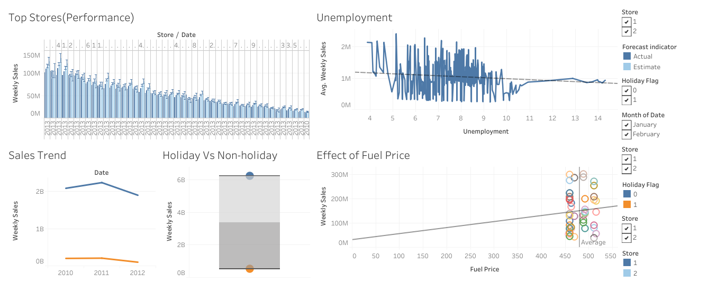

# 📊 Walmart Sales Analysis  

## 📌 Overview  
This project analyzes Walmart's sales data using **SQL, Excel, and Tableau** to uncover trends, seasonality, and key business insights. The goal is to help Walmart optimize sales strategies and inventory management.  

## 🔍 Key Insights  
- **Peak Sales Months**: Highest sales observed during non-holiday seasons.  
- **Unemployement Trends**: Unemployment affects sales
- **Fuel Price**: Increase in fuel prices affects sales  
- **Store Performance**: Some stores consistently outperform others.  
  
## 🛠 Tools Used  
- **SQL** (Data Cleaning & Analysis)  
- **Excel** (Pivot Tables, Charts)  
- **Tableau** (Interactive Dashboard)  

## 📁 Files Included  
📂 `Walmart_Sales_Analysis.sql` → SQL queries used for data cleaning and analysis.  
📂 `Walmart_Sales_Data.xlsx` → Cleaned dataset and Excel analysis.  
📂 `Walmart_Visualization.twbx` → Tableau dashboard file.  
📂 `Walmart_Dashboard.png` → Screenshot of the Tableau dashboard.  

## 📊 Tableau Dashboard  
  

## 📖 Blog Post  
Read more about this project here: [Medium Blog](link)  

---

### 🚀 **How to Use This Repository**  
1. Download the `Walmart_Sales_Data.xlsx` file for analysis.  
2. Open `Walmart_Sales_Analysis.sql` in **MySQL** to run queries.  
3. Open `Walmart_Dashboard.twbx` in **Tableau** to explore interactive visualizations.  

---

### 📢 **Connect with Me**  
If you have feedback or want to discuss this project, feel free to connect on **LinkedIn** or check out my **GitHub portfolio**! 😊  

🔗 **GitHub Portfolio**: [[https://github.com/your-username/Data-Analytics-Projects](https://github.com/anjalivijayan23)]  
🔗 **LinkedIn**: [Your LinkedIn Profile]([your-linkedin-url](https://www.linkedin.com/in/anjali-vijayan-14377a195/))  

---

